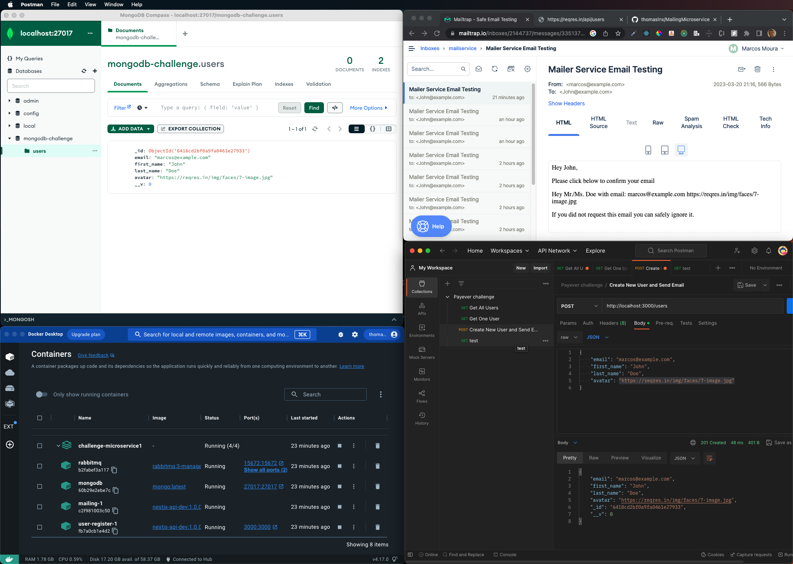

<p align="center">
  <a href="http://nestjs.com/" target="blank"></a>
</p>

[circleci-image]: https://img.shields.io/circleci/build/github/nestjs/nest/master?token=abc123def456
[circleci-url]: https://circleci.com/gh/nestjs/nest

  <p align="center">A progressive <a href="http://nodejs.org" target="_blank">Node.js</a> framework for building efficient and scalable server-side applications.</p>
    <p align="center">

<p align="center">
  </a>
</p>

  <!--[](https://opencollective.com/nest#backer)
  [](https://opencollective.com/nest#sponsor)-->

## Description

This little project aimed to show my abilities with backend development. In this project, I used NestJS, Typescript, Docker and Docker-Compose, MongoDB, Mongoose, MailTrap, and Handlebars to style and format minimal email templates, and microservices approach using RabbitMQ as a message broker to make the communication between these two services and to handle notification email sending after users creation.

## Note:

How this project is a fully dockerized backend application, there's no need to install anything on the test machine, just rebuild the docker containers.

## Building the containerized services

After unzipping the project folder run the following docker command inside the project's folder:

```bash
$ docker-compose up --build -V
```

This command will build the services inside the docker-compose file and start them:

## Testing the App

To test the app is necessary to use Postman or other tool to test the API endpoints. The following are the endpoint of the application:

List all users from API: GET http://locahost:3000/users;
<br/>
Get one user based on his id: GET http://localhost:3000/users/{id};
<br/>
Create a new user and send a confirmation email: POST http://localhost:3000/users,


```bash
# API routes
GET http://locahost:3000/users
GET http://localhost:3000/users/{id}
POST http://localhost:3000/users

# production mode
$ npm run start:prod
```

this last route needs a JSON body with the shape:

```bash
# JSON body for the POST request
{
  "email": example email;
  "first_name": example first name;
  "last_name":  example last name;
  "avatar": "https://reqres.in/img/faces/7-image.jpg"
}
```

Obs: the email sent after the new user creation it's using my personal Mail Trap account to test the sends. You can do tests about it using your own account, for this get to ```apps -> mailing -> src -> mailing.module.ts``` and set your own user and password from MailTrap inside the auth object.
```bash
auth: {
        user: '##############',
        pass: '##############'
      }
```
## Final words
I hope that I could show you that I can work with your stack and technologies, and besides that, I'm always open to learning new things and keeping myself updated and sharped about my daily work technologies. Thanks for your attention and consideration. In case of some doubt, technical issue, or more information, please do not hesitate to contact me. I'll hope to hear you about this.

## Stay in touch

- Author - Marcos de Moura Silva
- Github - [thomaslnx](https://github.com/thomaslnx)
- Twitter - [@thomaslnx](https://twitter.com/thomaslnx)

## License

Nest is [MIT licensed](LICENSE).
